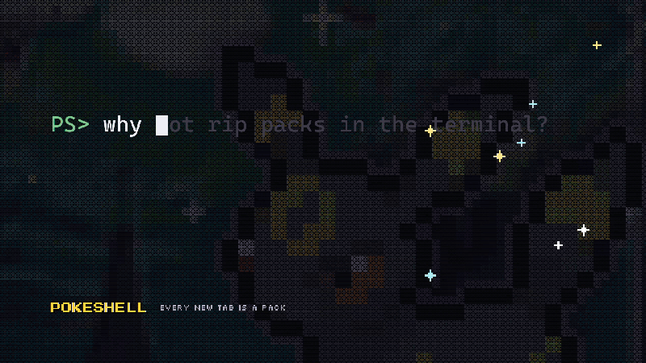
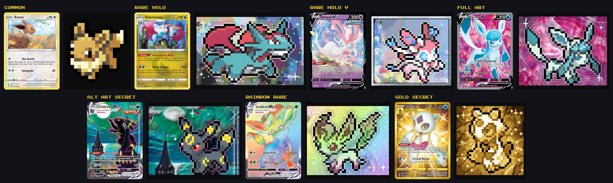
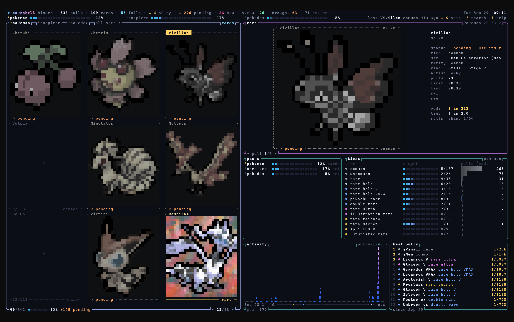
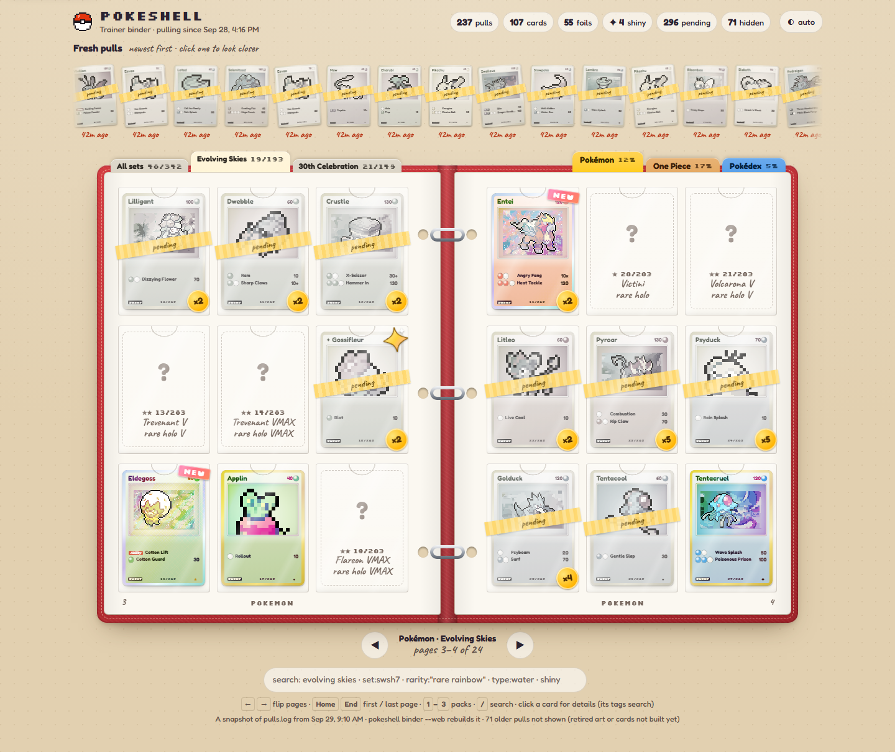
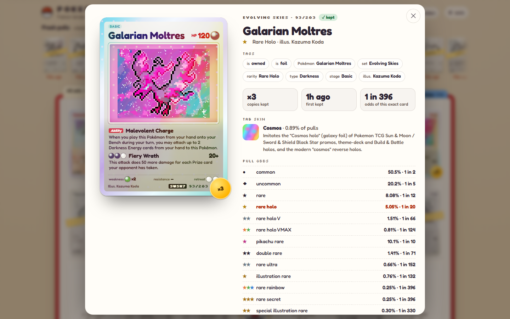

# pokeshell

Every new Windows Terminal PowerShell tab is a trading-card pack pull.

[](docs/media/promo.mp4)

*Click for the 32 s video with sound: real Windows Terminal pulls from Evolving Skies, the foil shaders, the card
animations, the earn line and both binders. Music: "Stormwind" by Hotham, from the
[Free Music Archive](https://freemusicarchive.org/music/hotham/single/stormwind/), licensed under
[CC BY 4.0](https://creativecommons.org/licenses/by/4.0/). Excerpted, faded and loudness-normalised.*

Every pull is a **real printed card**: the Pokemon's pixel sprite over that card's scene, framed like a card with
its name, printed number and rarity. Most tabs pull a common, which prints right there. Rarer cards (rare holo,
rare ultra, illustration rare, rare secret, hyper rare, ...) reopen the tab (same folder) wearing an animated
holofoil pixel-shader skin that matches the rarity (cosmos, sunpillar, illustration rare, gold, ...). A card with an
approved effect animation (its `.anim`, built with the card) then plays it over its art while the tab is idle: the
card prints at once, the effect loops at 12 fps until you type (at most 30 s), and the key you pressed is the first
character at the prompt. Every pull goes into your binder (`pokeshell binder`).

It's a fan project, not affiliated with the owners of the characters (see [Disclaimer](#disclaimer)).

**Real card vs pokeshell**, from Common to Gold (Evolving Skies). Each pair is the printed card, then the pull:



**The binder app** (`binder`): your cards, the selected card, completion per rarity, activity and best pulls:



**The web binder** (`binder --web`): a set's pages, and a card's page with its text half, tags and odds:





> **The card art is downloaded at install from the
> [gshklovs/pokeshell-art](https://github.com/gshklovs/pokeshell-art/releases) releases**, not kept in this
> repository. It embeds the [pokemon-colorscripts](https://gitlab.com/phoneybadger/pokemon-colorscripts) sprites
> (Nintendo artwork) over backgrounds painted from the real card scenes, so it lives in a separate art repo: the
> code stays here either way. `install.ps1` / `pokeshell install` fetches the release that [`art.json`](art.json)
> pins (about 4 MB of cards plus an optional 60 MB of card animations), checks its sha256 and unpacks it into
> `dist/pokemon/`. Offline, the code still installs and the pack just has nothing to pull until the art is there.
> The art belongs to its owners; this is a free, non-commercial fan project, and the art will be taken down on
> request (see [Disclaimer](#disclaimer)). Maintainers can also build it locally with `tools/build_realcards.py`
> (`tools/README.md`); the design of the art releases is in [docs/ART_RELEASES.md](docs/ART_RELEASES.md).

## Packs and odds

### Pokemon (`pokemon`): real cards, one tier per printed rarity, 18 foil skins

The pack is a list of real cards keyed by their [pokemontcg.io](https://pokemontcg.io) id (`swsh4-170` is Pikachu V,
Vivid Voltage 170/185). A card's tier is its **printed rarity**: `pack.json` has one tier per real rarity (common,
uncommon, rare, reverse holo, rare holo, rare holo V / VMAX / VSTAR, double rare, rare shiny, amazing rare, radiant
rare, rare ultra, illustration rare, rare rainbow, rare secret, special illustration rare, hyper rare, ...), each with
an odds weight, its holofoil skins and its card frame. A pull picks a tier by weight among the tiers that have a card,
then one of that tier's cards; nothing invented is ever shown. With the cards built so far:

| tier | odds | about 1 tab in | cards | skins |
|---|---:|---:|---|---|
| common | 87.20% | 1.1 | base1-44 Bulbasaur, base1-46 Charmander, base1-58 Pikachu, base1-63 Squirtle | none (plain tab) |
| rare holo | 8.72% | 11 | cel25-5 Pikachu | classic-holo, starlight, cosmos |
| rare shiny | 0.87% | 115 | sma-SV6 Charmander | shiny-vault |
| rare ultra | 1.13% | 88 | swsh4-170 Pikachu V | fingerprint, sunpillar, illustration-rare |
| illustration rare | 1.31% | 76 | sv3pt5-166 Bulbasaur, sv3pt5-168 Charmander, sv3pt5-170 Squirtle | ir-glow, illustration-rare |
| rare secret | 0.44% | 229 | ex3-98 Charmander | gold-facet, gold, rainbow-rare |
| hyper rare | 0.33% | 302 | sv8-247 Pikachu ex | gold |

Any pull, of any tier, is **shiny** (alternate palette) 1 time in 64. The odds and skins are data in
`packs/pokemon/pack.json` (format: `docs/PACK_FORMAT.md`); `pokeshell odds` always prints the live numbers, down to
"1 in N" for one specific card. New cards are added with `tools/build_realcards.py import <batch>`
(`tools/README.md`). More packs can be added under `packs/`; with several installed, `pokeshell pack all` makes each
tab first pick a pack at random.

## Requirements

- Windows 10/11 with **Windows Terminal 1.19 or newer** (pixel shaders, `WT_PROFILE_ID`)
- **Windows PowerShell 5.1** (built in) or **PowerShell 7**
- Nothing else. No Python, no other modules. The startup code is compiled once at install time with the C# compiler
  that ships with Windows / PowerShell. (Python is only needed to rebuild the art, see `tools/README.md`.)
- An internet connection at install, for the card art (a GitHub release download, see the note at the top).

## Install

From the [PowerShell Gallery](https://www.powershellgallery.com/packages/pokeshell):

```powershell
Install-Module pokeshell -Scope CurrentUser
pokeshell install
```

(On a fresh Windows PowerShell 5.1, `Install-Module` may first ask to install the NuGet provider: answer `Y`.)

`pokeshell install`:

1. downloads the card art: the [pokeshell-art](https://github.com/gshklovs/pokeshell-art/releases) release that
   `art.json` pins, verified against its sha256, unpacked into the module's (or the checkout's) `dist\` folder. It
   is skipped when the art there already matches `art.json`, and the zip is cached in
   `%LOCALAPPDATA%\pokeshell\art-cache`, so a module update re-installs it without downloading again,
2. copies what new tabs need (the profile hook, the startup core's source, the packs' shaders and art) into
   `%LOCALAPPDATA%\pokeshell\current`, a folder that stays put when the module is updated,
3. backs up Windows Terminal's `settings.json` to `%LOCALAPPDATA%\pokeshell\backups\`,
4. adds one **hidden** profile per shader of every pack (`pokeshell: pokemon/cosmos`, ...) to `settings.json`,
   pointing at the shaders in that folder. It edits only that list, as text, so your comments, formatting and
   every other setting stay byte-for-byte intact; it verifies the result (it parses, every skin is there, and
   removing them again gives back exactly the other settings) before writing anything. Windows Terminal reloads
   the file live. (Profiles go into `settings.json` rather than a settings fragment because fragments only load
   when Windows Terminal restarts.)
5. compiles the startup core, and
6. prints the one line to add to your PowerShell profile. It does not edit `$PROFILE` for you:

```powershell
notepad $PROFILE     # add the printed line:
. "$env:LOCALAPPDATA\pokeshell\current\scripts\pokeshell-profile.ps1"
```

Put it near the top so the art is the first thing in the tab. Open a new tab.

The line runs a small script, not the module: importing a module costs 50-100 ms per tab, the hook's budget is
~50 ms. It also defines `pokeshell` for that shell, which always runs the newest installed version of the module.

Options: `pokeshell install -SettingsPath <file>` for a specific `settings.json` (the default finds the Store,
Preview or unpackaged install), `-Shell pwsh` to run the skinned tabs with PowerShell 7. Safe to re-run.

The art options (the same for `.\install.ps1`):

| option | |
|---|---|
| `-Art auto` | (default) download the art if it is missing or older than the release `art.json` pins. A local build (`tools/build_realcards.py` output, or files changed after the download) is kept |
| `-Art download` | download even over a local build (same-named files are replaced, other local files stay) |
| `-Art local` | never download: use whatever is built in `dist\` |
| `-Art skip` | leave the art alone |
| `-ArtStillOnly` | skip the optional card animations (`.anim`, 60 MB); the cards themselves are about 4 MB |

If the download fails (offline, GitHub unreachable) the install still finishes and says so; cards without art simply
don't roll, and re-running install later fetches them. A download whose sha256 doesn't match `art.json` is refused.

Note: `Install-Module` from PowerShell 7 installs into `Documents\PowerShell\Modules`, which Windows PowerShell
doesn't search (and vice versa). Tabs don't care (they run from `%LOCALAPPDATA%\pokeshell\current`, and the
`pokeshell` the profile line defines finds the module in either folder); only a shell without the profile line
needs the module installed for its own edition.

### From source

```powershell
git clone https://github.com/gshklovs/pokeshell
cd pokeshell
powershell -ExecutionPolicy Bypass -File .\install.ps1
```

Same steps, except tabs run straight from the checkout (nothing is copied), so edits to shaders and packs show up
in new tabs right away. The printed line points into the repo, e.g. `. "C:\path\to\pokeshell\scripts\pokeshell-profile.ps1"`.
Re-run the installer after adding a pack or a shader, or after moving the repo folder.

### Developing: source checkout or module

A checkout can run your own tabs either way; both use the same state (`%LOCALAPPDATA%\pokeshell`: pull log,
config, binder data), so switching never loses pulls.

- **Source checkout** (edits show up in new tabs at once): `.\install.ps1`, and in `$PROFILE` the line
  `. "<repo>\scripts\pokeshell-profile.ps1"`. The hotkey and the `pokeshell://` handler point at
  `binder\target\release`.
- **Module** (what Gallery users run, installed locally from this checkout, no Gallery needed):

  ```powershell
  powershell -NoProfile -ExecutionPolicy Bypass -File tools\install-local-module.ps1 -SwitchProfile
  ```

  It rebuilds the binder if `binder\src` is newer than its exe, stages the module exactly as `tools\publish.ps1`
  would publish it into `Documents\WindowsPowerShell\Modules\pokeshell\<ModuleVersion>` (the folder
  `Install-Module -Scope CurrentUser` uses, OneDrive redirection included), adds this checkout's local-only packs
  and built art (git-ignored `packs\<id>` / `dist\<id>`; `-NoLocalPacks` stages only what the Gallery gets),
  backs up `$PROFILE` and `settings.json` to `%LOCALAPPDATA%\pokeshell\backups`, and runs
  `Import-Module pokeshell; pokeshell install` in a fresh shell. Install re-points the skin profiles, the
  Ctrl+Shift+B pane and the `pokeshell://` handler at `%LOCALAPPDATA%\pokeshell\current` (no uninstall needed
  first). `-SwitchProfile` swaps the checkout's `$PROFILE` line for
  `. "$env:LOCALAPPDATA\pokeshell\current\scripts\pokeshell-profile.ps1"`.
- **Updating the local module after repo changes**: run the same command again (same version: the folder is
  replaced; bump `ModuleVersion` in `pokeshell.psd1` to keep the old one side by side, as `Update-Module` would).
  New tabs pick it up once install has refreshed `current`. Close any open binder pane first: install replaces
  `current\bin\binder.exe`.
- **Back to the source checkout**: `.\install.ps1` from the repo (re-points everything at the checkout), put the
  checkout's line back in `$PROFILE` in place of the `current` one, and optionally
  `Remove-Item <Documents>\WindowsPowerShell\Modules\pokeshell -Recurse` (the `pokeshell` command the checkout's
  hook defines runs the checkout, not the module).

## Update

```powershell
pokeshell update          # Update-Module pokeshell, then pokeshell install from the new version
```

or by hand: `Update-Module pokeshell`, then `pokeshell install`. Until you re-run install, new tabs keep using
the previous version's copy in `%LOCALAPPDATA%\pokeshell\current` (and `pokeshell` reminds you). Your `$PROFILE`
line and the Windows Terminal profiles don't change, and old module versions can be removed at any time
(`Uninstall-Module pokeshell -RequiredVersion <old>`). From source: `git pull`, then `.\install.ps1`. Either
way, install fetches the art again only when the new `art.json` pins a newer art release.
`pokeshell version` shows which version is running and which one new tabs use.

## Uninstall

```powershell
pokeshell uninstall            # removes exactly the profiles install added (backs up first); keeps your binder
pokeshell uninstall -Purge     # also deletes %LOCALAPPDATA%\pokeshell (pull log, settings, backups, current)
Uninstall-Module pokeshell -AllVersions
```

Then delete the line from `$PROFILE` (until you do, tabs keep printing common pulls from
`%LOCALAPPDATA%\pokeshell\current`; after `-Purge` the line fails, so remove it first). From source:
`.\uninstall.ps1 [-Purge]`. To just pause it: `pokeshell off` (and `pokeshell on`).
## Commands

| command | what it does |
|---|---|
| `pokeshell pack [<pack>\|all]` | show or choose the pack new tabs pull from |
| `pokeshell odds [pack]` | the odds, per tier and per skin |
| `pokeshell binder` (or just `binder`) | the binder app, full screen in this tab; `q` gives the prompt back as it was. Opens on the last card you caught; `--pull <id>`, `--card <pack/character/tier>` or `--card pokemon/<card id>`, `--set <set>` (a set's checklist, by id or name: `swsh7`, `evolving`, `30th`), `--search <query>`. Without the app built (`binder\build.ps1`) it prints the text binder |
| `pokeshell binder --web` | rebuilds the static web binder into `%LOCALAPPDATA%\pokeshell\web` (about a second; needs Python with Pillow) and opens it |
| `pokeshell collection --json`, `version --json` | JSON for other tools: your caught and seen cards (with their gameplay data and art paths), and this install. See [For other tools](#for-other-tools) |
| `pokeshell collection` | the text binder: per pack, every character x tier you've earned, shiny counts, completion, best pulls, how many are pending; pulls of retired art, or of cards whose art isn't built, are left out |
| `pokeshell earn [first-command\|minutes:N\|off]` | what earns a pull: the first command you run in its tab (default), its tab staying open N minutes, or nothing (`off`: every pull counts at once) |
| `pokeshell hotkey [on\|off] [-Keys ctrl+shift+b]` | the Windows Terminal key (default `Ctrl+Shift+B`) that opens the binder in a split pane next to your work, on your newest pull. `pokeshell install` adds it to `settings.json` (backed up first, unless the keys are taken); `off` removes it and keeps later installs from adding it back; `pokeshell uninstall` removes it |
| `pokeshell urlhandler [on\|off] [-DryRun]` | the card's Ctrl+click link: `pokeshell://` under `HKCU\Software\Classes` (it runs the windowless `binder-link.exe`) plus `"safeUriSchemes": ["pokeshell"]` in `settings.json`. `pokeshell install` sets it up; `off` removes both and keeps later installs from adding them; `-DryRun` only lists the registry changes |
| `pokeshell show <pack>/<character> [variant] [-shiny] [-picture\|-card]` | print a card (`pokeshell show` lists everything built); `-picture` / `-card` override the display setting |
| `pokeshell display [card\|picture]` | how pulls print: `card` (default) is the full card (a framed card for packs with tier frames, otherwise the art plus the `label : name` line); `picture` is just the art. Saved in `config.txt`; `$env:POKESHELL_DISPLAY = 'picture'` overrides it for one shell (and the foil tabs it opens) |
| `pokeshell holo [<skin>\|plain] [-s] [-r]` | open a skinned tab here; `-s` splits a pane instead; `-r` moves the Claude Code session running in this tab into the new one (`claude --resume`), e.g. from inside Claude Code: `! pokeshell holo -r cosmos` |
| `pokeshell color <name\|#hex\|reset>` | tint this tab (35 named colors; other CSS color names work too and are logged to `color-misses.log`) |
| `pokeshell colorwatch [on\|off]` | optional: tint each tab to match the `/color` of the Claude Code session running in it |
| `pokeshell on` / `off` | enable / disable startup pulls |
| `pokeshell install` / `uninstall` / `update` / `version` | see [Install](#install), [Update](#update), [Uninstall](#uninstall) |

`scripts\pokeshell.cmd` runs the same command from cmd, bash or Claude Code's `!` if you put its folder on your PATH:
`%LOCALAPPDATA%\pokeshell\current\scripts` for a module install (it survives updates), `scripts\` in a checkout.

## For other tools

Other programs (a deck builder, a battle game, a stats page) can read your pokeshell install through two JSON
commands. Each prints one JSON document on stdout, ASCII only (other characters are `\uXXXX` escapes), and exits
non-zero on an error (stdout is then `{"error": "..."}`). Run them as
`powershell -NoProfile -ExecutionPolicy Bypass -File <pokeshell.ps1> <args>`, with `POKESHELL_HOME` set to use
another state folder. `api` goes up when a shape changes incompatibly; fields are only ever added.

- **`pokeshell version --json`**: `{name, version, api, root, runtimeRoot, state, packaged, installedVersion, packs,
  carddata, webExport, commands, features}`. `root` is the checkout or module folder, `runtimeRoot` is where new
  tabs run from, and `state` is the state folder. `packs` lists the pack ids, `carddata` the packs that ship gameplay
  data, `webExport` is the `binder --web` folder (or `null`), and `commands` lists the JSON commands this version answers.
- **`pokeshell collection --json [--pack <id>]`**: your real cards, with the binders' rule (a card is **caught** once
  one of its pulls is earned, and **seen** when it was pulled but never earned; pulls of retired or unbuilt art are
  left out). `{api, version, state, pack, counts: {caught, seen, pulls, shiny}, cards: [...], seen: [...]}`:
  - `cards` has one entry per caught card, in the order first pulled: `{card, pack, character, name, set, setName,
    number, rarity, tier, tierLabel, tierRank, caught: true, count, shinyCount, shiny, new, firstCaught, lastCaught,
    art, data}`. Times are local ISO times.
  - `art` is `{ans, ansShiny, png, pngShiny, img, imgShiny}`. `ans` / `ansShiny` are the card's ANSI art files, `png`
    / `pngShiny` its web-export images (`binder --web`, 1 px per art pixel), and `img` / `imgShiny` the same images
    relative to `<state>\web\img`. A file that doesn't exist is `null`.
  - `data` is the card's gameplay data, or `null`: `{supertype, hp, types, subtypes, evolvesFrom, abilities: [{name,
    type, text}], attacks: [{name, cost, convertedEnergyCost, damage, text}], weaknesses: [{type, value}],
    resistances, retreatCost, rules}` (`hp` is a number, `rules` holds the V / VMAX / ex rule text).
  - `seen` lists the cards you pulled but haven't caught: `{card, ..., tierRank, caught: false, count, pending,
    firstSeen, lastSeen}`. `pending` is true while a pull's tab can still catch it. A seen card has no `art` and no
    `data`: like the binder's text half, an uncaught card's moveset stays hidden.

```json
{"api":1,"version":"0.1.0","state":"C:\\Users\\you\\AppData\\Local\\pokeshell","pack":null,
 "counts":{"caught":1,"seen":1,"pulls":2,"shiny":1},
 "cards":[{"card":"base1-4","pack":"pokemon","character":"charizard","name":"Charizard","set":"base1","setName":"Base",
   "number":"4/102","rarity":"Rare Holo","tier":"rare-holo","tierLabel":"rare holo","tierRank":5,"caught":true,
   "count":2,"shinyCount":1,"shiny":true,"new":false,"firstCaught":"2026-09-28T21:04:11","lastCaught":"2026-09-29T09:12:40",
   "art":{"ans":"...\\dist\\pokemon\\charizard-base1-4.ans","ansShiny":"...\\dist\\pokemon\\charizard-base1-4-shiny.ans",
          "png":null,"pngShiny":null,"img":null,"imgShiny":null},
   "data":{"supertype":"Pok\u00e9mon","hp":120,"types":["Fire"],"subtypes":["Stage 2"],"evolvesFrom":"Charmeleon",
     "abilities":[{"name":"Energy Burn","type":"Pok\u00e9mon Power","text":"As often as you like during your turn ..."}],
     "attacks":[{"name":"Fire Spin","cost":["Fire","Fire","Fire","Fire"],"convertedEnergyCost":4,"damage":"100",
                 "text":"Discard 2 Energy cards attached to Charizard in order to use this attack."}],
     "weaknesses":[{"type":"Water","value":"\u00d72"}],"resistances":[{"type":"Fighting","value":"-30"}],
     "retreatCost":["Colorless","Colorless","Colorless"],"rules":[]}}],
 "seen":[{"card":"base1-2","pack":"pokemon","character":"blastoise","name":"Blastoise","set":"base1","setName":"Base",
   "number":"2/102","rarity":"Rare Holo","tier":"rare-holo","tierLabel":"rare holo","tierRank":5,"caught":false,
   "count":1,"pending":false,"firstSeen":"2026-09-29T10:00:00","lastSeen":"2026-09-29T10:00:00"}]}
```

The gameplay data ships with pokeshell as `packs/pokemon/carddata.json`. It holds only the cards in `pack.json` and
only these fields, taken from the [pokemontcg.io](https://pokemontcg.io) API card data. `tools/build_carddata.py`
builds it (see `tools/README.md`), and each new set's checklist runs it. The file has one card per line, so a reader can
pick out cards without parsing the whole file. Other tools should use the commands, not read `pulls.log` or
`pack.json` themselves.

## How it works

### The startup pull

`scripts/pokeshell-profile.ps1` runs from your profile in every new shell. For a fresh tab of your plain
PowerShell profile it rolls: pick a pack, then foil or not (`foil_chance`), then a skin weighted across the foil
tiers (the tier it belongs to sets the label and which art variant shows), a character uniformly, and shiny
(`shiny_chance`). A real-card pack (like `pokemon`) instead picks a rarity tier by its weight, one of that tier's
cards, and one of the tier's skins (tiers without skins print in the plain tab).

- **common**: print `dist/<pack>/<character>-<art>[-shiny].ans` and the banner, right there (a real card's art is
  `dist/<pack>/<character>-<card id>[-shiny].ans`).
- **foil**: open a new tab (or a split pane, if this is a pane) with the skin's hidden profile, in the same folder,
  which prints the art and banner; then this tab exits with code 0, so Windows Terminal closes it and the skinned
  tab takes its place.

Every pull is logged to `%LOCALAPPDATA%\pokeshell\pulls.log`, with a pull id, as **pending**: you earn the card by
using its tab (below). A small footer under the card, `binder ⏎  ctrl+click · ctrl+shift+b`, says how to open the
binder on it: Ctrl+click the link, or press the key.

It's fast: Windows PowerShell 5.1 pays about a millisecond the first time each line of script runs, so the
decision logic is C# (`scripts/lib/Pokeshell.cs`, compiled once to `%LOCALAPPDATA%\pokeshell\pokeshell-core-*.dll`),
the roll table is a prebuilt TSV cache, and the art is a prebuilt ANSI file. A tab adds ~20 ms when it doesn't
roll and ~25-50 ms for a common pull (`tests/measure-startup.ps1` measures it on your machine).

**Why pulled tabs take about half a second:** Windows Terminal compiles a profile's pixel shader when a tab with
that profile opens. The foil tab appears, compiles its skin, then prints. That's also why a foil tab starts a
beat after the plain one closes.

### The binder and the earned rule

A card only goes into your binder once you use the tab it was pulled in:

1. **Roll**: every pull gets an id (a ULID) and is logged `pending`; the tab carries it as `POKESHELL_PULL` (a foil's
   skinned tab too).
2. **First use**: the tab's first real command (anything that lands in the history; an empty Enter doesn't count)
   appends `earned:<id>` to `pulls.log` and prints one dim line: `✦ Pikachu holo added to your binder`. The hook is a
   few lines in the compiled core (a `PreCommandLookupAction` that wraps whatever `prompt` you have, so prompt themes
   and a `function prompt` later in `$PROFILE` keep working); it removes itself once the pull is earned.
3. **Closed unused**: a pending pull expires after 24 hours or when the machine restarts (the log then gets
   `expired:<id>`).
4. **In the binder**, like a Pokédex, every card is **empty** (never pulled: an empty pocket), **seen** (pulled but never
   caught, its tab unused or closed: the sprite's dark silhouette with its name and number) or **caught** (the real
   card). A card you haven't looked at yet has a **NEW** sticker (`viewed.txt` remembers what you've seen). The binders
   count `caught N · seen M`, and open on the last card you caught.

Four ways in, all set up by `pokeshell install` (nothing else to run):

- **Ctrl+click** the `binder ⏎` footer under a freshly pulled card: the binder opens in a split pane of that window, on
  that card (a card you haven't caught yet shows its silhouette). Windows Terminal opens links on Ctrl+click only; the
  link is `pokeshell://binder?pull=<id>`, registered for your user (`HKCU\Software\Classes\pokeshell`) and listed in
  `settings.json`'s `safeUriSchemes`, so it opens without Windows Terminal's "may lead to an unsafe location" dialog.
  The handler is `binder-link.exe`, a windowless launcher (no console flash) that only accepts
  `?pull=<ulid>` / `?card=<pack/character/tier>` and hands `wt -w 0 split-pane` the binder with that pull.
- **Ctrl+Shift+B** anywhere in Windows Terminal: the same split pane, on your newest pull (unless it has expired: then
  the last card you caught).
- `binder` / `pokeshell binder`: the app full screen in this tab (`q` returns).
- `binder --web`: a static page.

`pokeshell hotkey off` / `pokeshell urlhandler off` turn either off for good; without the binder app built, the footer
is a plain `binder ⏎` (type it: the text binder). In the app: arrows / `hjkl` move,
`1`-`9` switch packs, `S` opens the set picker (each set's completion; type to filter, Enter opens that set's whole
checklist, with empty pockets for the cards you haven't pulled), `#17` jumps to a printed number, `/` searches, `o` /
`m` show only the cards you caught / haven't caught, `v` shows a caught card's text half (HP, attacks, weakness) under the art when
`packs/<pack>/cards/<card id>.json` exists (cards you haven't caught keep it hidden until you catch them), `p` shows
the real printed card beside ours (caught cards only, like `v`), `d` toggles one-slot-per-character, `?` lists the rest.

**The printed card** (`p`, in the app and on the web page): pokemontcg.io's scan of the card, as tall as ours and
beside it (our card shrinks a little to make room; in a narrow pane the printed card takes its place). Scans are not
part of pokeshell or its art release: the app downloads one the first time you look at it (in the background, so it
never holds up the binder) and keeps it in `%LOCALAPPDATA%\pokeshell\cache\realcards`; the web page links it and your
browser loads it. Offline, or a card with no scan online, shows a short note instead. In Windows Terminal 1.22+ the app
draws it as a sixel image (a crisp picture); elsewhere in half blocks, like our art. It asks the terminal (DA1) the
first time; `POKESHELL_SIXEL=off` (or `sixel=off` in `config.txt`) forces half blocks, `on` forces sixel.

**Tags and search** (the app and the web page): every card is tagged with its set (id and name), printed rarity and
tier, subtypes (V, VMAX...), types (Grass, Water...), character, artist and pack, plus `caught`, `seen`, `missing`,
`shiny`, `foil` and `new` from your pulls. Search with words and tag filters, e.g. `evolving skies`, `set:swsh7`,
`rarity:"rare rainbow"`, `type:water vmax`, `artist:"PLANETA Tsuji"`, `shiny`. In the web binder, the tag chips on a
card's page run that search, and each set has its own divider tab.

The app is Rust (`binder/`, ratatui): `powershell -File binder\build.ps1` builds it into
`binder\target\release\binder.exe`, next to `binder-link.exe` (the link launcher), with the MSVC toolchain
(`cargo +stable-x86_64-pc-windows-msvc`). Build it before `install.ps1`, or re-run the install after building: the
install sets up the hotkey and the card link only when it finds the app.

### Where a foil opens

`wt.exe -w 0` means "the most recently used window", which is only this tab's window if that window is in the
foreground. So before replacing itself, a foil pull briefly sets a unique tab title and looks for it with UI
Automation in the foreground Windows Terminal window (~150 ms, foil pulls only). Found as the only pane of the
selected tab: new tab. Found as one pane of a split: new split pane in its place. Not found (the tab opened in a
background window, focus moved away, or your profile sets `suppressApplicationTitle`): the pull shows here as a
common instead, and nothing else is opened.

New tabs open at the end of the tab row unless you set `"newTabPosition": "afterCurrentTab"` in Windows Terminal;
since a new tab is normally the last one anyway, the skinned tab lands where the plain one was either way.

### Safety: it can't spawn tabs in a loop

A tab that opens a tab is one bug away from a fork bomb, so there are independent layers, and each one alone
stops it (`tests/test-no-loop.ps1` checks every one of them, plus the worst case where all identity checks fail):

1. **Profile identity**: only rolls when `WT_PROFILE_ID` is one of your plain profiles. Skinned tabs have their
   own profile GUIDs.
2. **No arguments**: only rolls when the shell was started with no command-line arguments (`-NoLogo` is allowed).
   The pulled tab is started with `-NoExit -EncodedCommand`; scripts, `-Command`, Claude tabs never roll.
3. **Environment markers**: `POKESHELL_PULL` (set before spawning, and in the pulled tab) and `POKESHELL_ROLLED`
   (set in every tab once it has rolled, so a `powershell` you start inside a tab never rolls), and `CARDSHELL_ROLLED`,
   shared with [opshell](#coexistence-with-opshell) (see below).
4. **Machine-wide rate limit**: a lock file (`spawn-gate.txt`) allows at most one foil spawn every 3 seconds
   across all tabs; a sixth spawn within 60 seconds trips a 10-minute breaker during which every pull is a common.
   Tested with 12 processes racing for the lock at the same instant: exactly one wins.
5. **Placement**: a foil only replaces a tab it has positively found in the foreground window (above).
6. **Installed skins only**: skins that `pokeshell install` hasn't registered never drop; before install, every
   pull is a common.
7. **Kill switch**: `pokeshell off`, or `POKESHELL_DISABLE=1` in the environment.

If opening the tab fails for any reason, the pull prints in place and the tab stays open.

### Coexistence with opshell

[opshell](https://github.com/gshklovs/opshell) is the One Piece sister project on the same engine (its own
command, module, state folder, Windows Terminal profiles and compiled core, so both install side by side). If your
`$PROFILE` has both hook lines, only one of them pulls per tab: whichever hook rolls first sets
`CARDSHELL_ROLLED=1` in the tab's environment, and both hooks skip when it is set. So the hook listed first in
`$PROFILE` pulls in every tab; to alternate, keep only one line, or switch with `pokeshell off` / `opshell off`.
(opshell also skips when `POKESHELL_ROLLED` is set, so this holds with pokeshell 0.1.0 too, as long as the
pokeshell line comes first.)

### Packs, art and shaders

A pack is a folder `packs/<id>/`:

- `pack.json`: odds, tiers, characters (format: `docs/PACK_FORMAT.md`)
- `art/<character>.json`: pixel art as palette-indexed rows, one variant per tier art name, optional shiny
  palette (format and size limits: `docs/ART_FORMAT.md`)
- `shaders/<skin>.hlsl`: Windows Terminal pixel shaders, one per foil skin (spec: `docs/SHADER_SPEC.md`)

`tools/build_art.py` renders the art to `dist/<pack>/<character>-<variant>[-shiny].ans` (24-bit color, two
pixels per character cell with half blocks). Users never need Python: the real-card `pokemon` pack's built art
(`dist/pokemon/`) is a release of [pokeshell-art](https://github.com/gshklovs/pokeshell-art/releases) that install
downloads (see the note at the top), and its sources (`art/<card id>.json`, and `cards/<card id>.json`, the card
text) are built locally by `tools/build_realcards.py` and never committed. The card text is not in the art
release: the binder's `v` text half needs `tools/fetch_cards.py --all`. The gameplay fields alone (HP, types,
attacks, weakness, ...) ship with the code as `packs/pokemon/carddata.json` (`tools/build_carddata.py`), for
`collection --json`.

### Adding a pack

1. Create `packs/<id>/pack.json` (format: `docs/PACK_FORMAT.md`): `foil_chance`, `shiny_chance`, `characters`,
   and `tiers` (tier 0 is the plain, non-foil tier; each foil tier names its `art` variant and its skins with
   relative weights).
2. Draw `packs/<id>/art/<character>.json` for every character, with every art variant the tiers name.
3. Write `packs/<id>/shaders/<skin>.hlsl` for every skin; compile-check them with `fxc` (see the shader spec).
4. Build the art (`tools/README.md`) and commit `dist/<id>/`.
5. Re-run `install.ps1` (`pokeshell install`), then `pokeshell pack <id>` and `pokeshell odds`.

## Settings and files

Everything lives in `%LOCALAPPDATA%\pokeshell` (or `$env:POKESHELL_HOME`):

| file | |
|---|---|
| `config.txt` | `key=value`: `pack`, `enabled`, `display` (`card` or `picture`), `earn` (`first-command`, `minutes:N` or `off`), `anim` (`untilkey`, the default: a card's effect loops until you type, at most 30 s; `intro`: one loop; `off`: the static card only; `$env:POKESHELL_NO_ANIM = 1` turns it off for one shell), `plain_profiles` (comma-separated profile GUIDs that roll; default: the built-in Windows PowerShell and PowerShell 7 profiles. Add yours if you use a custom profile.), and `best_since` (where the binders' best pulls start: a local date or time like `2026-09-29` or `2026-09-29T00:40`, or `all`; default: your first pull of a real card, so older pulls don't crowd them out) |
| `pulls.log` | one tab-separated line per pull: time, pack, character, tier, art, skin, shiny, flags (`pending`, notes), `id=<ulid>`, `boot=<n>` (for a real card, tier is its rarity tier and art its card id); plus `earned:<id>` / `expired:<id>` lines. Append-only: older lines without an id count as earned, and pulls of art that no longer exists stay in it (the binders hide them: `retired` in `docs/PACK_FORMAT.md`) |
| `viewed.txt` | pull ids the binder has shown (no more NEW sticker) |
| `web/` | the web binder (`binder --web`) |
| `hotkey.tsv`, `urlhandler.txt`, `safeuri.tsv` | the binder hotkey, the `pokeshell://` handler and the `safeUriSchemes` entry install added, so uninstall removes exactly that (the card footer also reads the first two); `hotkey.off`, `urlhandler.off`: you turned one off, so install leaves it out |
| `color-misses.log` | color names that weren't in the table |
| `installed.tsv` | the skin profiles install added (what uninstall removes) |
| `roll.tsv` | the roll table cache (rebuilt automatically when a pack, its art, or the install changes) |
| `spawn-gate.txt` | recent foil spawns for the rate limit |
| `pokeshell-core-*.dll`, `pokeshell-anim-*.dll` | the compiled roll core and card-animation player (`scripts/lib/Pokeshell.cs`, `scripts/lib/Anim.cs`), built by install or the first tab that needs them |
| `backups/` | `settings.json` copies taken before every install/uninstall |
| `errors.log` | anything that went wrong at startup (the hook never throws into your profile) |
| `current/` | module installs only: the runtime new tabs use (hook, core source, shaders, art), refreshed by `pokeshell install` |
| `pokeshell-core-*.dll` | the compiled startup core |
| `art-cache/` | the verified art release zips `art.json` pins (older ones are pruned) |

## Tests

```powershell
powershell -NoProfile -ExecutionPolicy Bypass -File tests\run-all.ps1
```

`test-no-loop` (the loop-safety layers, in simulation and with real processes), `test-install` (install /
uninstall round trips on copies of `settings.json`, including comments, trailing commas, BOM and the legacy
profiles format), `test-cli`, `test-cards`, `test-json` (the JSON commands: their shapes, caught vs seen checked
against the web export, a Base Set Charizard's gameplay data, `carddata.json` coverage and the tool's gap report, and
1000 pulls in under 1.5 s), `test-earned` (pull ids, the first-command hook in child processes,
expiry, NEW, the binder app's `--pull` / `--card` / `--set` / `--search`, `binder --web`, the hotkey on settings copies,
the link handler: registry as a dry run, `safeUriSchemes` on settings copies), `test-art` (the art releases: archives and manifests, download, re-run, a newer
release, local builds kept, `-Art` modes, checksum mismatch, offline, hostile zips, and `pokeshell install` end to
end, all from `file://` fixture releases into temp folders; `-Online` also downloads the real release into a temp
folder), `test-module` (stages the Gallery module, imports it, installs, simulates an
`Update-Module` and the removal of the old version, with a temp `LOCALAPPDATA`), and `measure-startup`
(`-HookRoot <folder>` measures a deployed copy such as `%LOCALAPPDATA%\pokeshell\current`). They never touch your
real Windows Terminal settings, `$PROFILE`, or `%LOCALAPPDATA%\pokeshell`, and never open a tab.

## Publishing (maintainers)

```powershell
powershell -NoProfile -ExecutionPolicy Bypass -File tools\publish.ps1            # dry run: stage + Test-ModuleManifest + Publish-Module -WhatIf
$env:PSGALLERY_API_KEY = '<key>'
powershell -NoProfile -ExecutionPolicy Bypass -File tools\publish.ps1 -Publish   # really publish
```

`tools\publish.ps1` stages exactly what the module ships (manifest, `scripts\`, `packs\` json + shaders, `art.json`,
docs, README, LICENSE, and the built `binder.exe` + `binder-link.exe` in `bin\` so a Gallery install gets the binder, its
Ctrl+Shift+B pane and the card link; files git ignores never ship, so no Pokemon art) into a temp folder. Build the
binder first (`binder\build.ps1`): staging refuses exes older than the binder source. Bump `ModuleVersion` in
`pokeshell.psd1` before each release.

**The card art** is released separately, to [gshklovs/pokeshell-art](https://github.com/gshklovs/pokeshell-art):

```powershell
powershell -NoProfile -ExecutionPolicy Bypass -File tools\publish_art.ps1            # dry run: build + check the zips
powershell -NoProfile -ExecutionPolicy Bypass -File tools\publish_art.ps1 -Publish   # gh release create art-<date>, pin it in art.json
git commit art.json -m "art: pin art-<date>"                                          # installs fetch what art.json pins
```

It zips `dist\pokemon\*.ans` and `*.anim` (two assets, so the animations stay optional) with a manifest, checks
that each zip holds only that art and the manifest, uploads them as a new release and rewrites `art.json`
(`-Source <checkout>` when the art was built in another checkout). Details: [docs/ART_RELEASES.md](docs/ART_RELEASES.md).

## Disclaimer

pokeshell is an unofficial, non-commercial fan project. It is not affiliated with, endorsed by, or sponsored by
Nintendo, Game Freak, Creatures Inc., or The Pokemon Company. Pokemon character names and related marks belong to their respective owners and are
used here only to identify the characters. This repository contains no game sprites, official artwork or card
text. The `pokemon` pack's built card art (the [pokemon-colorscripts](https://gitlab.com/phoneybadger/pokemon-colorscripts)
sprites over backgrounds painted from the real card scenes) is published separately in
[gshklovs/pokeshell-art](https://github.com/gshklovs/pokeshell-art) and downloaded at install. That art belongs to
its owners; pokeshell is free and non-commercial, and the art will be taken down on request. If you are a rights
holder and want something changed or removed, please open an issue.

## License

MIT, see [LICENSE](LICENSE). The license covers the code; it grants no rights in
the characters themselves.
